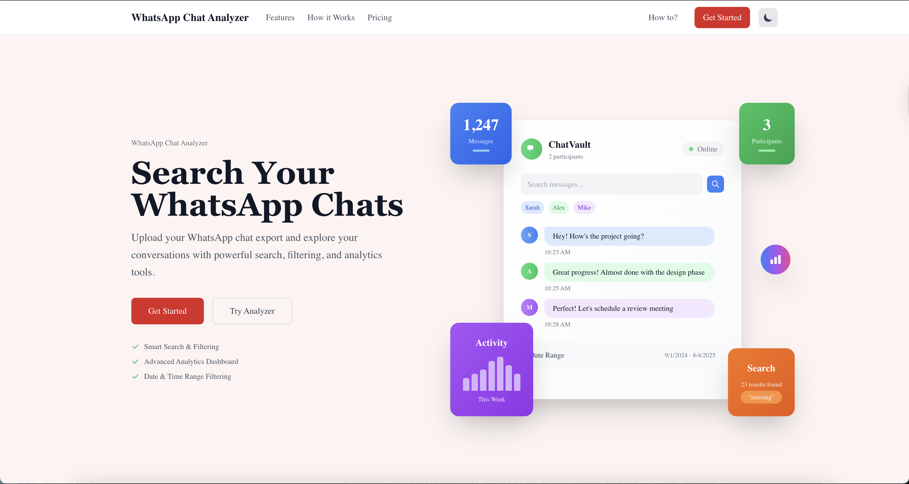

# ChatVault 🔍📊

**A comprehensive WhatsApp chat analysis platform** that transforms your exported conversations into actionable insights. Upload your `.txt` chat files and unlock powerful search capabilities, advanced analytics, and detailed conversation patterns.



## 🎯 Overview

ChatVault is a sophisticated web application designed to help you explore, analyze, and gain insights from your WhatsApp conversations. Whether you're a researcher studying communication patterns, a team leader analyzing group dynamics, or simply curious about your messaging habits, ChatVault provides the tools you need to understand your chat data.

### 🚀 Key Capabilities

- **🔍 Advanced Search & Filtering**: Find any message instantly with real-time keyword search, date filtering, and participant-based queries
- **📊 Comprehensive Analytics**: Dive deep into conversation patterns, sentiment analysis, and participant behavior
- **🤖 AI-Powered Insights**: Get intelligent answers to natural language queries about your conversations
- **📱 Beautiful Interface**: Modern, responsive design that works seamlessly across all devices
- **🔒 Privacy-First**: All processing happens locally - your data never leaves your device
- **⚡ High Performance**: Optimized for large chat files with efficient memory management

## ✨ Features

### 🔍 **Smart Search & Filtering**
- **Real-time Keyword Search**: Instantly find messages containing specific words or phrases
- **Advanced Date Filtering**: Filter by exact dates, date ranges, or time periods
- **Participant Filtering**: Focus on messages from specific people
- **Time-based Filtering**: Analyze activity patterns by hour, day, or month
- **Combined Filters**: Use multiple filters simultaneously for precise results

### 🤖 **AI-Powered Analysis**
- **Natural Language Queries**: Ask questions like "When did we discuss the project?" or "Find messages about dinner plans"
- **Intelligent Search**: AI understands context and finds relevant messages even with partial information
- **Smart Suggestions**: Get insights about conversation patterns and trends

### 📊 **Comprehensive Analytics Dashboard**

#### **Activity Analytics**
- **Hourly Activity Patterns**: See when conversations are most active throughout the day
- **Daily Activity Trends**: Understand which days of the week see the most engagement
- **Monthly Activity Overview**: Track conversation patterns over time
- **Peak Activity Identification**: Find the most active periods and participants

#### **Participant Analytics**
- **Individual Statistics**: Message counts, average message length, and activity patterns per person
- **Engagement Metrics**: Who talks the most, who responds quickly, and participation patterns
- **Communication Styles**: Analyze how different people communicate
- **Activity Heatmaps**: Visual representation of when each participant is most active

#### **Sentiment Analysis**
- **Emotional Trends**: Track sentiment changes throughout conversations
- **Participant Sentiment**: Understand the emotional tone of each person's messages
- **Conversation Phases**: Identify emotional highs and lows in your chats
- **Sentiment Correlation**: See how emotions affect conversation flow

#### **Response Time Analytics**
- **Response Patterns**: Analyze how quickly people respond to messages
- **Conversation Dynamics**: Understand the flow and rhythm of conversations
- **Engagement Metrics**: Identify the most responsive participants
- **Time-based Analysis**: See how response times vary throughout the day

#### **Topic Analysis**
- **Conversation Themes**: Automatically identify and categorize discussion topics
- **Topic Evolution**: Track how conversations evolve over time
- **Participant Interests**: See what topics each person engages with most
- **Topic Relationships**: Understand connections between different subjects

#### **Pattern Recognition**
- **Communication Patterns**: Identify recurring conversation structures
- **Interaction Styles**: Analyze how people interact with each other
- **Behavioral Insights**: Discover unique communication patterns
- **Relationship Dynamics**: Understand group dynamics and relationships

#### **Special Occasions Detection**
- **Event Identification**: Automatically detect birthdays, holidays, and special events
- **Celebration Tracking**: See how people celebrate and acknowledge special moments
- **Temporal Patterns**: Understand how conversations change around important dates

### 💬 **Enhanced Chat Interface**
- **Message Grouping**: Messages are intelligently grouped by sender and time
- **Timestamp Display**: Precise timestamps for every message
- **Search Highlighting**: Highlighted search results for easy identification
- **Message Navigation**: Jump to specific messages from search results
- **Responsive Design**: Optimized for desktop, tablet, and mobile viewing

### 📤 **Export & Data Management**
- **Multiple Export Formats**: Export to TXT, JSON, or CSV formats
- **Filtered Exports**: Export only the messages that match your current filters
- **Structured Data**: Get well-formatted data for further analysis
- **Batch Processing**: Handle multiple chat files efficiently

### 🌙 **User Experience**
- **Dark/Light Mode**: Toggle between themes for comfortable viewing
- **Mobile Responsive**: Full functionality on all device sizes
- **Keyboard Shortcuts**: Quick navigation and search shortcuts
- **Accessibility**: Designed with accessibility best practices
- **Performance Optimized**: Fast loading and smooth interactions

## 🚀 Getting Started

### Prerequisites

- **Node.js 18+** - Modern JavaScript runtime
- **npm or yarn** - Package manager
- **Modern Browser** - Chrome 90+, Firefox 88+, Safari 14+, Edge 90+

### Installation

1. **Clone the repository**:
```bash
git clone https://github.com/stevie1mat/ChatVault
cd ChatVault
```

2. **Install dependencies**:
```bash
npm install
# or
yarn install
```

3. **Start the development server**:
```bash
npm run dev
# or
yarn dev
```

4. **Open your browser** and navigate to [http://localhost:3000](http://localhost:3000)

### Production Deployment

1. **Build the application**:
```bash
npm run build
```

2. **Start the production server**:
```bash
npm start
```

## 📖 Usage Guide

### Step 1: Export Your WhatsApp Chat

1. **Open WhatsApp** and navigate to the chat you want to analyze
2. **Access Chat Settings**:
   - **Mobile**: Tap the chat name → More options → Export chat
   - **Desktop**: Click the three dots → Export chat
3. **Choose Export Format**: Select "Without Media" to get a `.txt` file
4. **Save the File**: The exported file will be saved to your device

### Step 2: Upload to ChatVault

1. **Navigate to the Upload Page**: Click "Get Started" on the homepage
2. **Upload Your File**:
   - **Drag & Drop**: Simply drag your `.txt` file onto the upload area
   - **Click to Browse**: Click "Choose File" to select your chat export
3. **Automatic Processing**: ChatVault will automatically parse and analyze your chat

### Step 3: Explore Your Data

#### **Basic Search & Filtering**
- **Keyword Search**: Type any word or phrase in the search bar
- **Date Filtering**: Use the date picker to select specific time periods
- **Participant Filtering**: Click on participant names to filter by sender
- **Time Filtering**: Set specific time ranges (e.g., 9 AM - 5 PM)

#### **Advanced Analytics**
- **Activity Dashboard**: View overall conversation patterns and statistics
- **Participant Analysis**: Explore individual participant behavior and engagement
- **Sentiment Analysis**: Understand emotional trends in your conversations
- **Topic Analysis**: Discover what topics are discussed most frequently
- **Response Time Analysis**: Analyze how quickly people respond to messages
- **Pattern Recognition**: Identify recurring communication patterns

#### **AI-Powered Search**
- **Natural Language Queries**: Ask questions like:
  - "When did we discuss the project deadline?"
  - "Find all messages about dinner plans"
  - "Show me conversations about the meeting"
- **Contextual Understanding**: AI understands conversation context and finds relevant messages
- **Smart Suggestions**: Get insights about your conversation patterns

### Step 4: Export Your Findings

1. **Apply Filters**: Use search and filtering to narrow down your results
2. **Choose Export Format**:
   - **TXT**: Plain text format for simple sharing
   - **JSON**: Structured data for further analysis
   - **CSV**: Spreadsheet-compatible format
3. **Download**: Click the export button to download your filtered data

## 📊 Analytics Features Deep Dive

### Activity Analytics
The Activity Analytics section provides comprehensive insights into when and how your conversations happen:

- **Hourly Activity**: Visual chart showing message frequency by hour
- **Daily Activity**: Weekly patterns showing which days are most active
- **Monthly Activity**: Long-term trends and seasonal patterns
- **Peak Activity Identification**: Automatic detection of most active periods
- **Activity Metrics**: Total messages, average per day, and engagement rates

### Participant Analytics
Understand how each person contributes to the conversation:

- **Individual Statistics**: Message counts, average length, and activity patterns
- **Engagement Metrics**: Response rates, participation frequency, and interaction patterns
- **Communication Styles**: Analysis of how each person communicates
- **Activity Heatmaps**: Visual representation of when each person is most active
- **Relationship Dynamics**: How people interact with each other

### Sentiment Analysis
Track emotional trends and patterns in your conversations:

- **Overall Sentiment**: Positive, negative, or neutral tone analysis
- **Participant Sentiment**: Individual emotional patterns for each person
- **Conversation Phases**: Identify emotional highs and lows over time
- **Sentiment Correlation**: How emotions affect conversation flow
- **Emotional Highlights**: Key moments of strong emotional expression

### Response Time Analytics
Analyze the dynamics of conversation flow:

- **Response Patterns**: How quickly people respond to messages
- **Conversation Dynamics**: Understanding the rhythm of conversations
- **Engagement Metrics**: Identifying the most responsive participants
- **Time-based Analysis**: How response times vary throughout the day
- **Relationship Insights**: Understanding communication patterns between people

### Topic Analysis
Discover what your conversations are really about:

- **Automatic Topic Detection**: AI-powered identification of conversation themes
- **Topic Evolution**: How discussions change and evolve over time
- **Participant Interests**: What topics each person engages with most
- **Topic Relationships**: Understanding connections between different subjects
- **Trending Topics**: What's being discussed most frequently

### Pattern Recognition
Identify recurring patterns in your communication:

- **Communication Patterns**: Recurring conversation structures and formats
- **Interaction Styles**: How people interact with each other
- **Behavioral Insights**: Unique communication patterns and habits
- **Relationship Dynamics**: Understanding group dynamics and relationships
- **Predictive Analysis**: Identifying potential future conversation patterns

## 🔧 Technical Architecture

### Built With Modern Technologies

- **Next.js 14** - React framework with App Router for optimal performance
- **TypeScript** - Type-safe JavaScript for better development experience
- **Tailwind CSS** - Utility-first CSS framework for rapid UI development
- **React Hooks** - Modern React state management and side effects
- **ESLint** - Code quality and consistency enforcement
- **Vercel** - Optimized for deployment on Vercel platform

### Project Structure

```
ChatVault/
├── public/                 # Static assets
│   ├── homepage.png       # Application screenshot
│   └── favicon.ico        # Browser favicon
├── src/
│   ├── app/               # Next.js App Router
│   │   ├── layout.tsx     # Root layout component
│   │   ├── page.tsx       # Homepage component
│   │   ├── upload/        # File upload functionality
│   │   │   └── page.tsx   # Upload page
│   │   ├── chat/          # Chat analysis features
│   │   │   ├── page.tsx   # Main chat interface
│   │   │   └── analytics/ # Comprehensive analytics
│   │   │       ├── page.tsx           # Analytics dashboard
│   │   │       ├── activity/          # Activity patterns
│   │   │       ├── participants/      # Participant analysis
│   │   │       ├── sentiment/         # Sentiment analysis
│   │   │       ├── response-times/    # Response time analysis
│   │   │       ├── topics/            # Topic analysis
│   │   │       ├── patterns/          # Pattern recognition
│   │   │       └── special-occasions/ # Event detection
│   │   └── globals.css    # Global styles
│   ├── components/        # Reusable React components
│   │   ├── AISearch.tsx   # AI-powered search component
│   │   ├── AISearchResults.tsx # AI search results display
│   │   ├── ChatMessage.tsx     # Individual message component
│   │   ├── ChatView.tsx        # Chat display component
│   │   ├── ExportButtons.tsx   # Export functionality
│   │   ├── FileUpload.tsx      # File upload component
│   │   ├── SearchFilters.tsx   # Search and filter controls
│   │   └── ThemeToggle.tsx     # Dark/light mode toggle
│   ├── types/            # TypeScript type definitions
│   │   └── chat.ts       # Chat-related types and interfaces
│   └── utils/            # Utility functions
│       └── chatParser.ts # Chat parsing and processing logic
├── package.json          # Dependencies and scripts
├── next.config.js        # Next.js configuration
├── tailwind.config.js    # Tailwind CSS configuration
├── tsconfig.json         # TypeScript configuration
└── README.md            # This file
```

### Key Implementation Details

#### **Chat Parsing Engine**
- **Regex-based Parsing**: Efficient parsing of WhatsApp export format
- **Error Handling**: Robust error handling for malformed chat files
- **Performance Optimization**: Optimized for large files with streaming processing
- **Format Support**: Supports various WhatsApp export formats and date formats

#### **Search & Filtering System**
- **Real-time Search**: Instant search results as you type
- **Efficient Filtering**: Optimized filtering algorithms using React useMemo
- **Combined Filters**: Support for multiple simultaneous filters
- **Search Highlighting**: Visual highlighting of search terms in results

#### **Analytics Engine**
- **Statistical Analysis**: Comprehensive statistical calculations for all metrics
- **Pattern Recognition**: AI-powered pattern detection and analysis
- **Data Visualization**: Beautiful charts and graphs for data representation
- **Performance Optimization**: Efficient processing of large datasets

#### **AI Integration**
- **Natural Language Processing**: Understanding of conversational queries
- **Context Awareness**: AI that understands conversation context
- **Smart Suggestions**: Intelligent recommendations and insights
- **Query Optimization**: Efficient processing of natural language queries

#### **User Interface**
- **Responsive Design**: Mobile-first approach with Tailwind CSS
- **Accessibility**: WCAG 2.1 compliant design
- **Performance**: Optimized rendering and smooth animations
- **Theme System**: Dark/light mode with persistent preferences

## 🛠️ Development

### Available Scripts

```bash
# Development
npm run dev          # Start development server
npm run build        # Build for production
npm run start        # Start production server

# Code Quality
npm run lint         # Run ESLint
npm run lint:fix     # Fix ESLint errors automatically

# Type Checking
npm run type-check   # Run TypeScript type checking
```

### Development Setup

1. **Clone and Install**:
```bash
git clone https://github.com/stevie1mat/ChatVault
cd ChatVault
npm install
```

2. **Environment Setup**:
```bash
# Create environment file (if needed)
cp .env.example .env.local
```

3. **Start Development**:
```bash
npm run dev
```

### Testing

- **Manual Testing**: Use the included `sample-chat.txt` file for testing
- **Browser Testing**: Test across different browsers and devices
- **Performance Testing**: Test with large chat files (1000+ messages)
- **Accessibility Testing**: Ensure WCAG compliance

### Code Quality

- **ESLint**: Enforces code style and catches potential errors
- **TypeScript**: Provides type safety and better development experience
- **Prettier**: Ensures consistent code formatting
- **Git Hooks**: Pre-commit hooks for code quality checks

## 🌐 Browser Support

| Browser | Version | Status |
|---------|---------|--------|
| Chrome | 90+ | ✅ Full Support |
| Firefox | 88+ | ✅ Full Support |
| Safari | 14+ | ✅ Full Support |
| Edge | 90+ | ✅ Full Support |
| Mobile Safari | 14+ | ✅ Full Support |
| Chrome Mobile | 90+ | ✅ Full Support |

## 🔒 Privacy & Security

### Privacy-First Approach
- **Local Processing**: All data processing happens in your browser
- **No Server Storage**: Your chat data never leaves your device
- **No Analytics Tracking**: We don't track your usage or collect personal data
- **Open Source**: Transparent codebase for security verification

### Data Handling
- **Client-Side Only**: No server-side processing of your chat files
- **Temporary Storage**: Data is only stored in browser memory during your session
- **No Persistence**: Chat data is not saved between sessions
- **Secure Exports**: Export files are generated locally on your device

## 🤝 Contributing

We welcome contributions from the community! Here's how you can help:

### How to Contribute

1. **Fork the Repository**: Create your own fork of the project
2. **Create a Feature Branch**: Make your changes in a new branch
3. **Make Your Changes**: Implement your feature or fix
4. **Test Thoroughly**: Ensure your changes work correctly
5. **Submit a Pull Request**: Create a PR with a clear description

### Contribution Guidelines

- **Code Style**: Follow the existing code style and ESLint rules
- **TypeScript**: Use TypeScript for all new code
- **Testing**: Add tests for new features when applicable
- **Documentation**: Update documentation for new features
- **Commit Messages**: Use clear, descriptive commit messages

### Areas for Contribution

- **New Analytics Features**: Add new types of analysis
- **UI/UX Improvements**: Enhance the user interface
- **Performance Optimization**: Improve app performance
- **Accessibility**: Make the app more accessible
- **Documentation**: Improve documentation and guides
- **Bug Fixes**: Fix reported issues

## 📞 Support & Community

### Getting Help

- **GitHub Issues**: Report bugs or request features
- **Documentation**: Check this README and inline code comments
- **Community**: Join discussions in GitHub discussions

### Common Issues

#### **File Upload Problems**
- **File Format**: Ensure you're uploading a `.txt` file exported from WhatsApp
- **File Size**: Large files may take longer to process
- **Browser Support**: Use a modern browser with File API support

#### **Search Issues**
- **No Results**: Try broader search terms or check your filters
- **Slow Performance**: Large files may take time to search through
- **AI Search**: Ensure you have an internet connection for AI features

#### **Analytics Issues**
- **Missing Data**: Some analytics require sufficient data to work properly
- **Performance**: Large files may take time to generate analytics
- **Browser Memory**: Very large files may exceed browser memory limits

## 📄 License

This project is licensed under the **MIT License** - see the [LICENSE](LICENSE) file for details.

The MIT License is a permissive license that allows you to:
- Use the software for any purpose
- Modify the software
- Distribute the software
- Use it commercially

## 🙏 Acknowledgments

- **WhatsApp** for providing the chat export functionality
- **Next.js Team** for the amazing React framework
- **Tailwind CSS** for the utility-first CSS framework
- **Open Source Community** for the tools and libraries that make this possible

## 📈 Roadmap

### Planned Features

- **🔗 API Integration**: REST API for programmatic access
- **📊 Advanced Visualizations**: More sophisticated charts and graphs
- **🤖 Enhanced AI**: More advanced natural language processing
- **📱 Mobile App**: Native mobile applications
- **☁️ Cloud Sync**: Optional cloud storage for chat data
- **👥 Team Features**: Collaborative analysis features
- **📈 Trend Analysis**: Long-term trend identification
- **🔍 Advanced Search**: More sophisticated search algorithms

### Version History

- **v1.0.0** - Initial release with basic chat parsing and search
- **v1.1.0** - Added analytics dashboard and advanced filtering
- **v1.2.0** - Introduced AI-powered search and sentiment analysis
- **v1.3.0** - Enhanced analytics with pattern recognition and topic analysis

## 📞 Contact

- **🌐 Website**: [stevenmathew.dev](https://stevenmathew.dev)
- **GitHub**: [@stevie1mat](https://github.com/stevie1mat)
- **Repository**: [https://github.com/stevie1mat/ChatVault](https://github.com/stevie1mat/ChatVault)
- **Issues**: [GitHub Issues](https://github.com/stevie1mat/ChatVault/issues)

---

**Made with ❤️ by [stevie1mat](https://github.com/stevie1mat)**

*Transform your WhatsApp conversations into insights with ChatVault* 🚀
